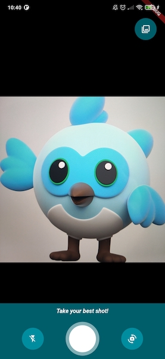
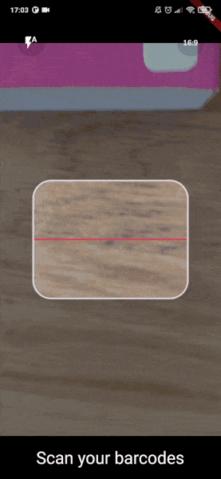

<a href="https://apparence.io">
  
</a>
<div style="margin-top:40px">
 
  
</div>


<br>
# CamerAwesome

<div>
    <a href="https://github.com/Solido/awesome-flutter">
        
    </a>
    <a href="https://github.com/Apparence-io/camera_awesome">
        
    </a>
    <a href="https://pub.dev/packages/camerawesome">
        
    </a>
</div>


📸 自分のアプリにカメラ体験を組み込むことは、それほど難しいことではないはずだ。
<br> 素晴らしいAndroid / iOSカメラ体験を統合するためのflutterプラグイン。<br>

<br>
このパッケージは、アプリ内で使用できる完全にカスタマイズ可能なカメラ体験を提供します。<br>
私たちの素晴らしい組み込みインターフェイスを使用するか、またはあなたが望むようにカスタマイズします。

---


## マイグレーションガイド

バージョン1.x.xから2.x.xへ移行する場合は
[マイグレーションガイド]

## ネイティブの特徴

ここでは、cameraAwesomeがフラッター側に提供するすべてのネイティブ機能を紹介する。

| Features                                 | Android | iOS |
| :--------------------------------------- | :-----: | :-: |
| 🔖 Ask permissions                       |   ✅    | ✅  |
| 🎥 Record video                          |   ✅    | ✅  |
| 📹 Multi camera (🚧 BETA)                |   ✅    | ✅  |
| 🔈 Enable/disable audio                  |   ✅    | ✅  |
| 🎞 Take photos                            |   ✅    | ✅  |
| 🌆 Photo live filters                    |   ✅    | ✅  |
| 🌤 Exposure level                         |   ✅    | ✅  |
| 📡 Broadcast live image stream           |   ✅    | ✅  |
| 🧪 Image analysis (barcode scan & more.) |   ✅    | ✅  |
| 👁 Zoom                                   |   ✅    | ✅  |
| 📸 Device flash support                  |   ✅    | ✅  |
| ⌛️ Auto focus                            |   ✅    | ✅  |
| 📲 Live switching camera                 |   ✅    | ✅  |
| 😵‍💫 Camera rotation stream              |   ✅    | ✅  |
| 🤐 Background auto stop                  |   ✅    | ✅  |
| 🔀 Sensor type switching                 |   ⛔️    | ✅  |
| 🪞 Enable/disable front camera mirroring |   ✅    | ✅  |

---

## 📖&nbsp; インストールと使用方法

### Add the package in your `pubspec.yaml`

```yaml
dependencies:
  camerawesome: ^2.0.0-dev.1
  ...
```

### プラットフォーム固有のセットアップ

- **iOS**

Add these on `ios/Runner/Info.plist`:

```xml
<key>NSCameraUsageDescription</key>
<string>Your own description</string>

<key>NSMicrophoneUsageDescription</key>
<string>To enable microphone access when recording video</string>

<key>NSLocationWhenInUseUsageDescription</key>
<string>To enable GPS location access for Exif data</string>
```

- **Android**

Change the minimum SDK version to 21 (or higher) in `android/app/build.gradle`:

```
minSdkVersion 21
```


> `WRITE_EXTERNAL_STORAGE` is not included in the plugin starting with version
> 1.4.0.

If you want to record videos with audio, add this permission to your
`AndroidManifest.xml`:

```xml
<manifest xmlns:android="http://schemas.android.com/apk/res/android"
        package="com.example.yourpackage">
  <uses-permission android:name="android.permission.RECORD_AUDIO" />

  <!-- Other declarations -->
</manifest>
```

You may also want to save location of your pictures in exif metadata. In this
case, add below permissions:

```xml
<manifest xmlns:android="http://schemas.android.com/apk/res/android"
  package="com.example.yourpackage">
  <uses-permission android:name="android.permission.ACCESS_FINE_LOCATION" />
  <uses-permission android:name="android.permission.ACCESS_COARSE_LOCATION" />

  <!-- Other declarations -->
</manifest>
```

<details>
<summary>⚠️ Overriding Android dependencies</summary>

Some of the dependencies used by CamerAwesome can be overriden if you have a
conflict. Change these variables to define which version you want to use:

```gradle
buildscript {
  ext.kotlin_version = '1.7.10'
  ext {
    // You can override these variables
    compileSdkVersion = 33
    minSdkVersion = 24 // 21 minimum
    playServicesLocationVersion = "20.0.0"
    exifInterfaceVersion = "1.3.4"
  }
  // ...
}
```

Only change these variables if you are sure of what you are doing.

For example, setting the Play Services Location version might help you when you
have conflicts with other plugins. The below line shows an example of these
conflicts:

```
java.lang.IncompatibleClassChangeError: Found interface com.google.android.gms.location.ActivityRecognitionClient, but class was expected
```

</details>

### Flutterアプリにパッケージをインポートする

```dart
import 'package:camerawesome/camerawesome_plugin.dart';
```

---

## 👌 素晴らしい内蔵インターフェース

私たちのビルダーをご利用ください。 <br> アプリ内で完全なカメラ体験を実現するために必要なものはこれだけです。
アプリ内で完全なカメラ体験を作成するために必要なものです。

```dart
CameraAwesomeBuilder.awesome(
  saveConfig: SaveConfig.photoAndVideo(),
  onMediaTap: (mediaCapture) {
    OpenFile.open(mediaCapture.filePath);
  },
),
```


このビルダーは様々な設定でカスタマイズできる：
- A theme.
- Builders for each part of the screen.
- Initial camera setup.
- Preview positioning.
- Additional preview decoration.
- And much more!

例を挙げよう：



---

## 🎨 カスタムインターフェースの作成

If the `awesome()` factory is not enough, you can use `custom()` instead.

It provides a `builder` property that lets you create your own camera
experience. <br>

The camera preview will be visible behind what you will provide to the builder.

```dart
CameraAwesomeBuilder.custom(
  saveConfig: SaveConfig.photo(),
  builder: (state, previewSize, previewRect) {
    // create your interface here
  },
)
```


### カスタムビルダーとの協力

Here is the definition of our builder method.

```dart
typedef CameraLayoutBuilder = Widget Function(CameraState cameraState, PreviewSize previewSize, Rect previewRect);
```

<br>
カメラを管理できるのはcameraStateだけです。<br>
どの州でカメラを体験するかによって、いくつかの異なる方法を利用できる。<br>
previewSize`と`previewRect`は、カメラプレビューの周りや上にUIを配置するために使われます。
<br>

#### CamerAwesomeのステートはどのように機能するのですか？

この状態を使えば、カメラの流れを考えることなく、必要なことは何でもできる。<br><br>

- On app start we are in `PreparingCameraState`<br>
- Then depending on the initialCaptureMode you set you will be
  `PhotoCameraState` or `VideoCameraState`<br>
- Starting a video will push a `VideoRecordingCameraState`<br>
- Stopping the video will push back the `VideoCameraState`<br>
  <br> Also if you want to use some specific function you can use the when
  method so you can write like this.<br>

```dart
state.when(
  onPhotoMode: (photoState) => photoState.start(),
  onVideoMode: (videoState) => videoState.start(),
  onVideoRecordingMode: (videoState) => videoState.pause(),
);
```

<br>

---

## 🐝 写真やビデオのイベントを聴く

onMediaCaptureEventを使えば、あらゆるメディア・キャプチャ・イベントをリッスンし、それを使って好きなことができる。
を使うことができる。

```dart
onMediaCaptureEvent: (event) {
    switch ((event.status, event.isPicture, event.isVideo)) {
        case (MediaCaptureStatus.capturing, true, false):
            debugPrint('Capturing picture...');
        case (MediaCaptureStatus.success, true, false):
            event.captureRequest.when(
                single: (single) {
                debugPrint('Picture saved: ${single.file?.path}');
                },
                multiple: (multiple) {
                multiple.fileBySensor.forEach((key, value) {
                    debugPrint('multiple image taken: $key ${value?.path}');
                });
                },
            );
        case (MediaCaptureStatus.failure, true, false):
            debugPrint('Failed to capture picture: ${event.exception}');
        case (MediaCaptureStatus.capturing, false, true):
            debugPrint('Capturing video...');
        case (MediaCaptureStatus.success, false, true):
            event.captureRequest.when(
                single: (single) {
                    debugPrint('Video saved: ${single.file?.path}');
                },
                multiple: (multiple) {
                    multiple.fileBySensor.forEach((key, value) {
                        debugPrint('multiple video taken: $key ${value?.path}');
                    });
                },
            );
        case (MediaCaptureStatus.failure, false, true):
            debugPrint('Failed to capture video: ${event.exception}');
        default:
            debugPrint('Unknown event: $event');
    }
},
```

---

## 🔬 解析モード

これを利用して達成しよう：

- QR-Code scanning.
- Facial recognition.
- AI object detection.
- Realtime video chats.
- And much more 🤩


`ディレクトリでMLKitを使ったサンプルを確認することができます。上の
ai_analysis_faces.dart`の例である。これは顔を検出し
輪郭を描画する。

MLKitを使ってバーコードを読み取ることも可能だ：




### 使用方法

```dart
CameraAwesomeBuilder.awesome(
  saveConfig: SaveConfig.photo(),
  onImageForAnalysis: analyzeImage,
  imageAnalysisConfig: AnalysisConfig(
        // Android specific options
        androidOptions: const AndroidAnalysisOptions.nv21(
            // Target width (CameraX will chose the closest resolution to this width)
            width: 250,
        ),
        // Wether to start automatically the analysis (true by default)
        autoStart: true,
        // Max frames per second, null for no limit (default)
        maxFramesPerSecond: 20,
    ),
)
```


⚠️ On Android, some devices don't support video recording and image analysis at
the same time.

- If they don't, image analysis will be ignored.
- You can check if a device has this capability by using
  `CameraCharacteristics .isVideoRecordingAndImageAnalysisSupported(Sensors.back)`.

---

## 🐽 センサー設定の更新

Through state you can access to a `SensorConfig` class.

<br>

| Function               | Comment                                                    |
| ---------------------- | ---------------------------------------------------------- |
| `setZoom`              | change zoom                                                |
| `setFlashMode`         | change flash between NONE,ON,AUTO,ALWAYS                   |
| `setBrightness`        | change brightness level manually (better to let this auto) |
| `setMirrorFrontCamera` | set mirroring for front camera                             |

これらのコンフィギュレーションはすべて、ストリームを通してリッスン可能である。
は実際のコンフィギュレーションに従って自動的に更新される。

<br>

## 🌆 フォトライブフィルター

内蔵のインターフェイスを使用して、写真にライブフィルタを適用します：


また、最初から特定のフィルターを使うこともできる：


```dart
CameraAwesomeBuilder.awesome(
  // other params
  filter: AwesomeFilter.AddictiveRed,
  availableFilters: ...
)
```

または、プログラムでフィルタを設定する：

```dart
CameraAwesomeBuilder.custom(
  builder: (cameraState, previewSize, previewRect) {
    return cameraState.when(
      onPreparingCamera: (state) =>
      const Center(child: CircularProgressIndicator()),
      onPhotoMode: (state) =>
          TakePhotoUI(state, onFilterTap: () {
            state.setFilter(AwesomeFilter.Sierra);
          }),
      onVideoMode: (state) => RecordVideoUI(state, recording: false),
      onVideoRecordingMode: (state) =>
          RecordVideoUI(state, recording: true),
    );
  },
)
```

> [!TIP] By default the awesome ui setup has a filter list but you can pass an
> empty list to remove it

## 📷 📷 コンカレントカメラ


> 🚧 Feature in beta 🚧 Any feedback is welcome!


```dart
CameraAwesomeBuilder.awesome(
    sensorConfig: SensorConfig.multiple(
        sensors: [
            Sensor.position(SensorPosition.back),
            Sensor.position(SensorPosition.front),
        ],
        flashMode: FlashMode.auto,
        aspectRatio: CameraAspectRatios.ratio_16_9,
    ),
    // Other params
)
```


<br>

<a href="">
  
</a>

